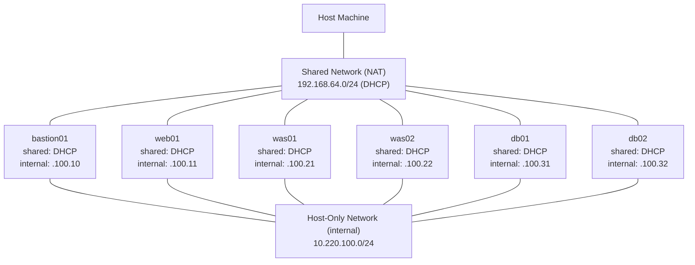

# ansible-rockylinux-3tier

## 1. Overview

This repository contains the **Ansible-based automated provisioning playbook** for the initial configuration of Rocky Linux 9 virtual machines deployed under the standard 3-Tier architecture (WEB / WAS / DB).

## 2. Network Architecture

Each VM is connected to two networks: a **Shared** network for host access and internet, and a **Host-Only** network (`internal`) for inter-VM communication.



### 2.1 Subnet Allocation

| Network | Type | CIDR | IP Assignment | Purpose |
|---------|------|------|---------------|---------|
| shared | Shared | 192.168.64.0/24 | DHCP | Host SSH access, internet |
| internal | Host-Only | 10.220.100.0/24 | Static | VM internal communication (WEB -> WAS -> DB) |

## 3. Host Inventory

| Tier | Hostname | Shared (DHCP) | Host-Only (10.220.100.*) |
|------|----------|---------------|--------------------------|
| Bastion | bastion01 | DHCP | .100.10 |
| WEB | web01 | DHCP | .100.11 |
| WAS | was01 | DHCP | .100.21 |
| WAS | was02 | DHCP | .100.22 |
| DB | db01 | DHCP | .100.31 |
| DB | db02 | DHCP | .100.32 |

## 4. Prerequisites

### 4.1 Network Configuration (Manual)

Before executing any automated provisioning, each VM **must** have its network interfaces configured manually according to the allocation defined in Section 2.

Refer to: [`docs/vm-network-setup.md`](docs/vm-network-setup.md)

### 4.2 Bastion Host Preparation

Install the required runtime dependencies on the Bastion server:

```bash
sudo dnf install -y python3-pip sshpass
sudo pip3 install --upgrade ansible-core passlib
echo 'export PATH=/usr/local/bin:$PATH' >> ~/.bashrc
source ~/.bashrc
```

### 4.3 Ansible Collection Dependencies

```bash
ansible-galaxy collection install -r requirements.yml
```

## 5. Vault

Sensitive data is stored in Ansible Vault files excluded from version control via `.gitignore`.

| File | Contents |
|------|----------|
| `group_vars/all/vault.yml` | Service user password |
| `group_vars/was/vault.yml` | DB connection credentials |

```bash
# Encrypt
ansible-vault encrypt inventories/production/group_vars/all/vault.yml
ansible-vault encrypt inventories/production/group_vars/was/vault.yml

# Decrypt
ansible-vault decrypt inventories/production/group_vars/all/vault.yml

# Edit encrypted file
ansible-vault edit inventories/production/group_vars/was/vault.yml

# View encrypted file
ansible-vault view inventories/production/group_vars/was/vault.yml
```

## 6. Execution Procedures

All commands require `--ask-vault-pass` since vault files are used across all tiers.

### 6.1 Full Provisioning (All Hosts)

```bash
ansible-playbook site.yml --ask-pass --ask-become-pass --ask-vault-pass
```

### 6.2 Tier-Specific Execution

```bash
# WEB tier only
ansible-playbook site.yml --ask-pass --ask-become-pass --ask-vault-pass --limit web

# WAS tier only
ansible-playbook site.yml --ask-pass --ask-become-pass --ask-vault-pass --limit was

# DB tier only
ansible-playbook site.yml --ask-pass --ask-become-pass --ask-vault-pass --limit db
```

### 6.3 Targeted Host Execution

```bash
ansible-playbook site.yml --ask-pass --ask-become-pass --ask-vault-pass --limit "was01,was02"
```

## 7. License

This project is licensed under the [MIT License](LICENSE).
